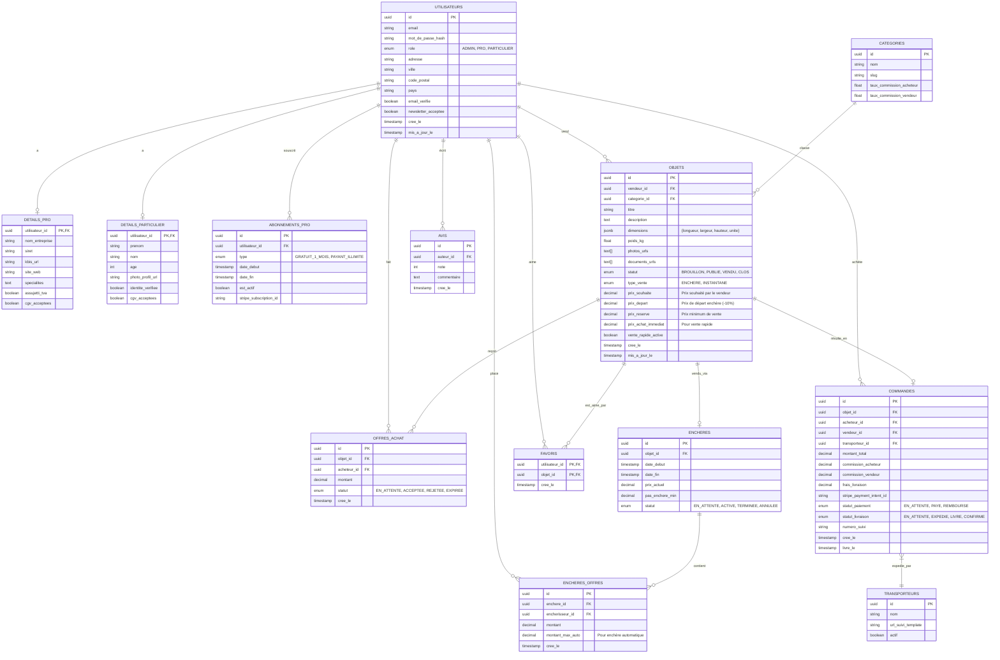

# Purple Dog - Schéma de Base de Données

```mermaid
erDiagram
    UTILISATEURS ||--o| DETAILS_PRO : "a"
    UTILISATEURS ||--o| DETAILS_PARTICULIER : "a"
    UTILISATEURS ||--o{ ABONNEMENTS_PRO : "souscrit"
    UTILISATEURS ||--o{ OBJETS : "vend"
    UTILISATEURS ||--o{ ENCHERES_OFFRES : "place"
    UTILISATEURS ||--o{ OFFRES_ACHAT : "fait"
    UTILISATEURS ||--o{ COMMANDES : "achète"
    UTILISATEURS ||--o{ AVIS : "écrit"
    UTILISATEURS ||--o{ FAVORIS : "aime"

    CATEGORIES ||--o{ OBJETS : "classe"

    OBJETS ||--o| ENCHERES : "vendu_via"
    OBJETS ||--o{ OFFRES_ACHAT : "reçoit"
    OBJETS ||--o| COMMANDES : "résulte_en"
    OBJETS ||--o{ FAVORIS : "est_aime_par"

    ENCHERES ||--o{ ENCHERES_OFFRES : "contient"

    COMMANDES }|--|| TRANSPORTEURS : "expedie_par"

    UTILISATEURS {
        uuid id PK
        string email
        string mot_de_passe_hash
        enum role "ADMIN, PRO, PARTICULIER"
        string adresse
        string ville
        string code_postal
        string pays
        boolean email_verifie
        boolean newsletter_acceptee
        timestamp cree_le
        timestamp mis_a_jour_le
    }

    DETAILS_PRO {
        uuid utilisateur_id PK, FK
        string nom_entreprise
        string siret
        string kbis_url
        string site_web
        text specialites
        boolean assujetti_tva
        boolean cgv_acceptees
    }

    ABONNEMENTS_PRO {
        uuid id PK
        uuid utilisateur_id FK
        enum type "GRATUIT_1_MOIS, PAYANT_ILLIMITE"
        timestamp date_debut
        timestamp date_fin
        boolean est_actif
        string stripe_subscription_id
    }

    DETAILS_PARTICULIER {
        uuid utilisateur_id PK, FK
        string prenom
        string nom
        int age
        string photo_profil_url
        boolean identite_verifiee
        boolean cgv_acceptees
    }

    CATEGORIES {
        uuid id PK
        string nom
        string slug
        float taux_commission_acheteur
        float taux_commission_vendeur
    }

    OBJETS {
        uuid id PK
        uuid vendeur_id FK
        uuid categorie_id FK
        string titre
        text description
        jsonb dimensions "{longueur, largeur, hauteur, unite}"
        float poids_kg
        text[] photos_urls
        text[] documents_urls
        enum statut "BROUILLON, PUBLIE, VENDU, CLOS"
        enum type_vente "ENCHERE, INSTANTANE"
        decimal prix_souhaite "Prix souhaité par le vendeur"
        decimal prix_depart "Prix de départ enchère (-10%)"
        decimal prix_reserve "Prix minimum de vente"
        decimal prix_achat_immediat "Pour vente rapide"
        boolean vente_rapide_active
        timestamp cree_le
        timestamp mis_a_jour_le
    }

    ENCHERES {
        uuid id PK
        uuid objet_id FK
        timestamp date_debut
        timestamp date_fin
        decimal prix_actuel
        decimal pas_enchere_min
        enum statut "EN_ATTENTE, ACTIVE, TERMINEE, ANNULEE"
    }

    ENCHERES_OFFRES {
        uuid id PK
        uuid enchere_id FK
        uuid encherisseur_id FK
        decimal montant
        decimal montant_max_auto "Pour enchère automatique"
        timestamp cree_le
    }

    OFFRES_ACHAT {
        uuid id PK
        uuid objet_id FK
        uuid acheteur_id FK
        decimal montant
        enum statut "EN_ATTENTE, ACCEPTEE, REJETEE, EXPIREE"
        timestamp cree_le
    }

    FAVORIS {
        uuid utilisateur_id PK, FK
        uuid objet_id PK, FK
        timestamp cree_le
    }

    TRANSPORTEURS {
        uuid id PK
        string nom
        string url_suivi_template
        boolean actif
    }

    COMMANDES {
        uuid id PK
        uuid objet_id FK
        uuid acheteur_id FK
        uuid vendeur_id FK
        uuid transporteur_id FK
        decimal montant_total
        decimal commission_acheteur
        decimal commission_vendeur
        decimal frais_livraison
        string stripe_payment_intent_id
        enum statut_paiement "EN_ATTENTE, PAYE, REMBOURSE"
        enum statut_livraison "EN_ATTENTE, EXPEDIE, LIVRE, CONFIRME"
        string numero_suivi
        timestamp cree_le
        timestamp livre_le
    }

    AVIS {
        uuid id PK
        uuid auteur_id FK
        int note
        text commentaire
        timestamp cree_le
    }
```
